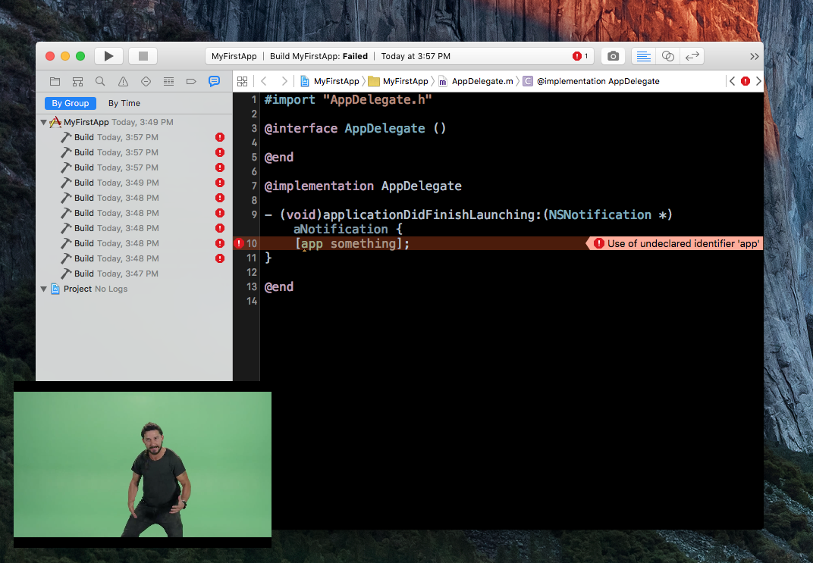

# You-Can-Do-It
Is learning a new language getting you down? Worry not, this Xcode plugin will keep you motivated.

This is an Xcode plugin which every three build failures in a row will show you an inspirational Shia LaBeouf reminder why you are doing this.

Remember; me and Shia think you can do it. So get on with it.

### Install

Install it either through [Alcatraz](http://alcatraz.io) or manually:

* `git clone https://github.com/orta/You-Can-Do-It.git`
* Open the Xcode project.
* Perform the build command.
* Restart Xcode.

### Copyrights

I stole some code from the [AxeMode plugin](https://github.com/alloy/AxeMode) released under the [MIT license](https://github.com/alloy/AxeMode/blob/master/LICENSE)
